# linux-palvelimet
linux palvelimet kurssin palautukset
## Minä
Nimeni on Albert Rashica ja "app.terokarvinen.com"-sivusta löydät minut käyttäjänimellä bgx106.

# h1 Oma Linux
Tässä kirjoitin tiivistelmän, missä kävin läpi teorian
## x) Raportin kirjoittaminen ja FSF:Free Software Definition muistiinpanot
- Täsmällinen teksti
- virheen uudelleen luominen
- Freedom to run(F0),Freedom to modify(F1), Freedom to copy(F2), Freedom to distribute(F3)

## a) Linuxin asentaminen
Koska minulla oli jo virtualbox ja Debian 12 live ISO valmiiksi ladattuna, tein uuden VM-koneen omalle raudalle.
Oman raudan specsit ovat CPU 6 ytimen-prosessori, 16GB ram, sekä tarpeeksi tallennustilaa.

### Ensin avasin virtualboxin seuraavasti

### VM-alkuasetukset
Tässä kohtaa valitsin new ja tein alkuasetukset VM-koneelle. Annoin nimeksi 'linux-palvelimet' VM-koneelle. Versioksi Valitsin Debian (64-bit). Varmistin myös, että "Skip unattended installation" on päällä. Disk Image:n jätin VDI:ksi.

### Vram-muistin alustava sijoitus
Laitoin että VM saa tarpeeksi näyttömuistia. Laitoin myös 3D acceleration päälle.


### ISO-levystä asennus
Tässä sitten suoritin VM-koneen installerin, jotta sain Debian 12 live asennettua.

### Asennuksen viimeistely
Tässä sitten viimeistelin asennuksen ja annoin Guest-hostille nimeksi 'linux-palvelimet'. Annoin root-salasanat ja käyttäjätunnukset käytettäväksi. Käytin Guided disk, eli koko virtuaalinen levy käytettäväksi.

#### Huomio!
Varmistin myös että käytettiin Network Mirroria, jotta saa apt-paketit käyttäytymään oikein. On kokemusta kun olen ennen tehnyt tätä virhettä.

## asennuksen jälkeen
Asennuksen jälkeen kirjauduin Root-käyttäjänä ja lisäsin itseni eli käyttäjän bgx106 sudo-ryhmään. Varmistin myös että kaikki paketit olivat uusimpia ja päivitin ne. Tässä ovat ne seuraavat komennot.
```usermod -aG sudo bgx106```
```sudo apt update && sudo apt upgrade -y```

Tämän jälkeen uskoin että kaikki on nyt ok ja aloitin tehtävän palauttamisen.


# h2 Komentaja pingviini
## x)Lue ja tiivistä muistiinpanot
 - "/etc/", järjestelmän asetukset ja yms.
 - "/var/log/", kaikki logit.
 - "sudo apt-get update", päivittää uusimmat mahdolliset asennettavat ohjelmat.
## a) Micron asennus
seuraavaksi asensin mikron.
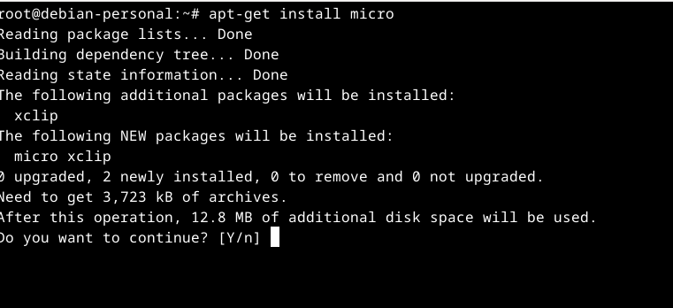
## b) koneen rauta
on käytössä SSD, sekä tarpeeksi muistitilaa. Olen antanut virtuaaliselle koneelle käytöksi 4 ydintä(virtuaalista, joten säikeitä, koska löytyy prosessorilta säikeitä)
käytössä on nopea muisti, hyperX ram-muisti.
tarkistin koeeni raudan:
- Amd Ryzen 5 3600
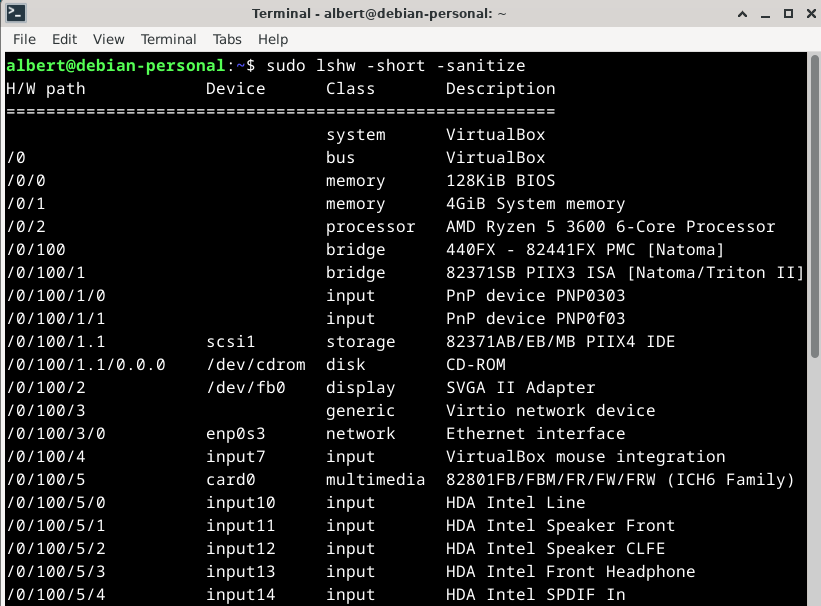
## c) kolme ohjelmaa, micro(edellinen kuva), apache2, lshw
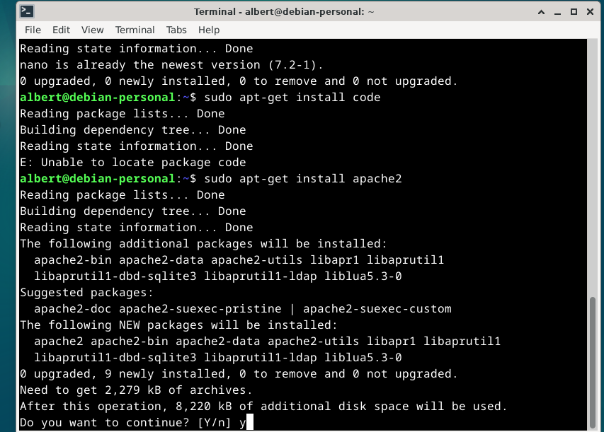
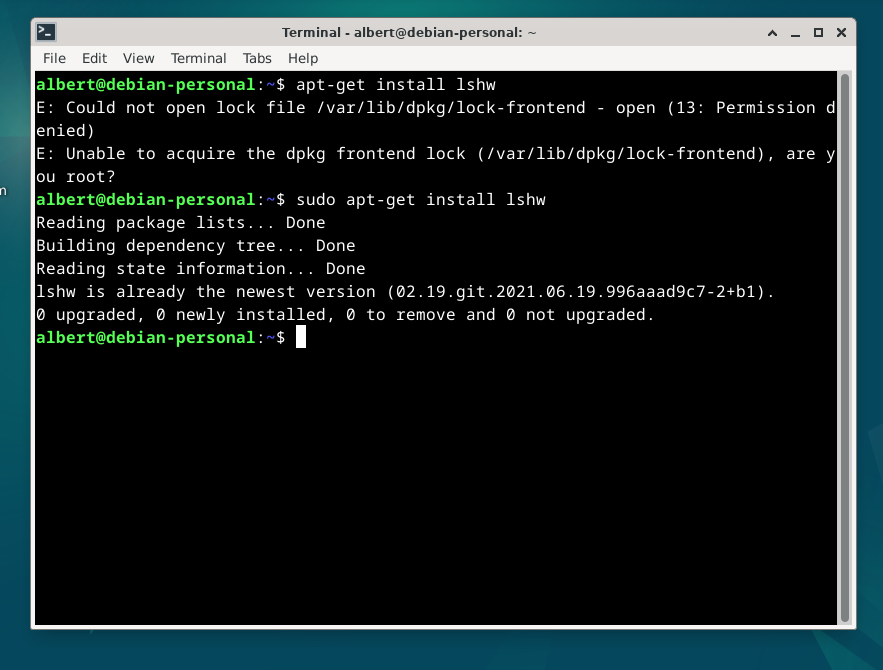
## d) FHS:Esittele kansiot
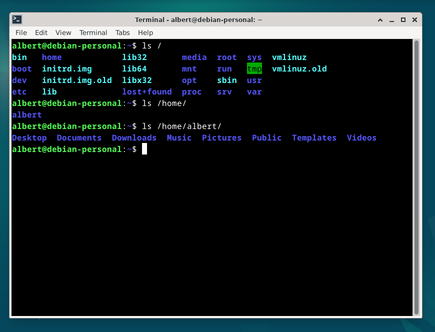
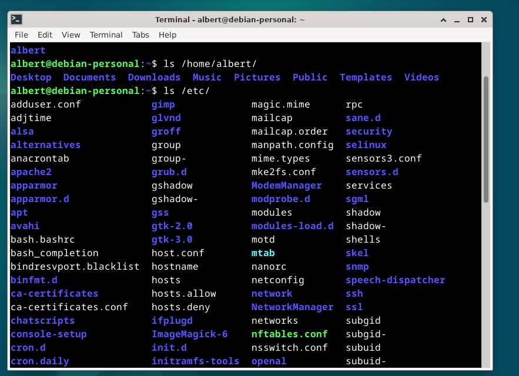
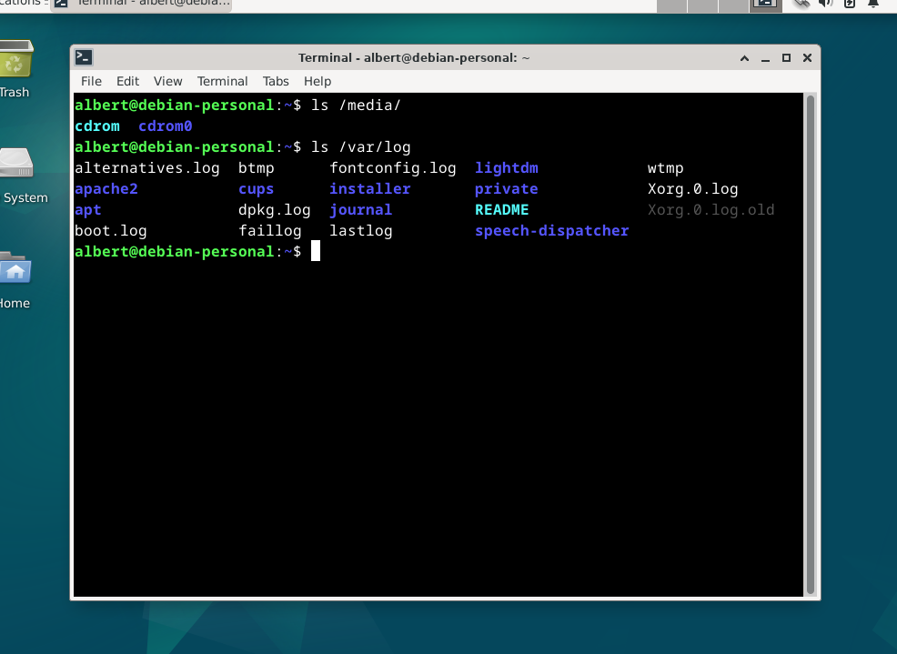
## e + f) GREP-komennot pipen kanssa
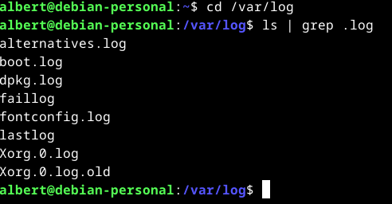
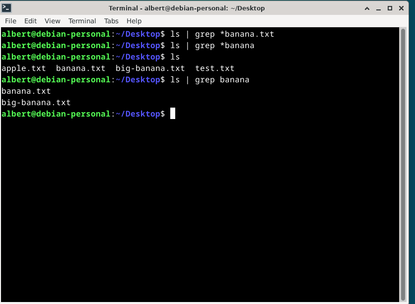
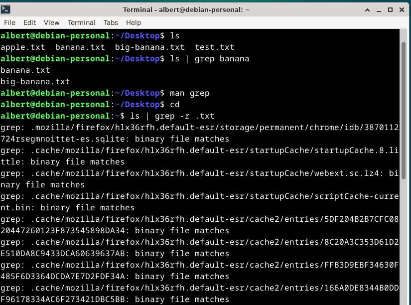
## g) Esimerkki onnistuneesta ja ei onnistuneesta komennosta

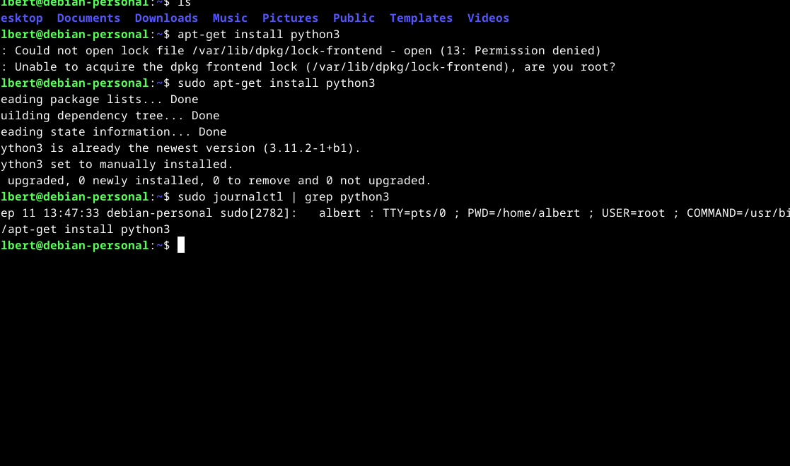


# h3 Web server
## x) Muistiinpanot
- "sudo a2enmod userdir", käyttäjille luvan antaminen
- "sudo systemctl restart apache2", jos on tehnyt muutoksia
## a) apache asennus
mulla oli jo valmiiksi asennettuna

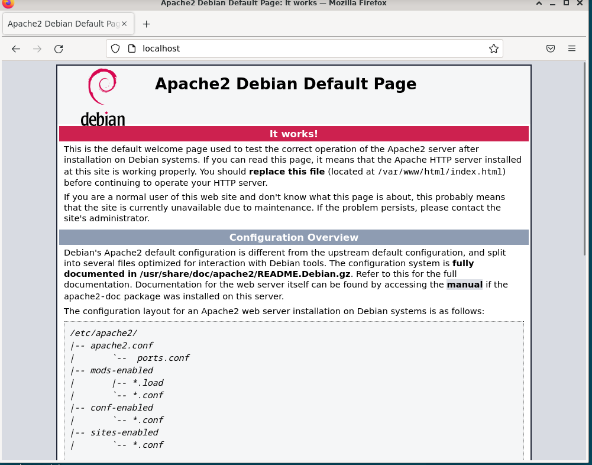
## b) lokit
kukin rivi kertoo että on tehty GET-pyyntö. Ensin pyydetään hakukoneen tiedot, sitten iconi, joka on apachen oma ikoni. sitten pyydetään favicon.
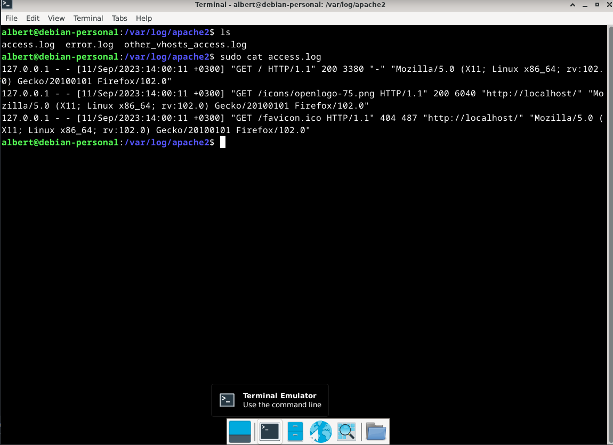
## c) sivun vaihto uuteen
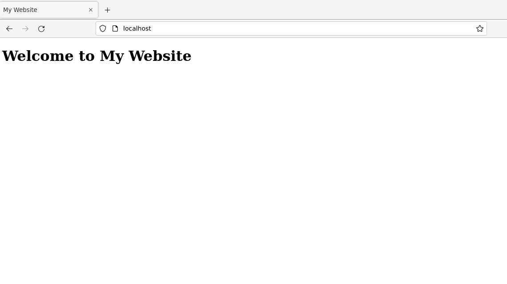

## d) Käyttäjän kotisivut
Ensin aktivoin käyttäjien sivut komennolla "sudo a2enmod userdir".
Sen jälkeen käynnistän apache2 uudelleen komennolla "sudo systemctl restart apache2".
Tämän jälkeen luon public_html kansion "/home/albert" kansion sisälle ja sen sisälle laitan muokatun index.html tiedoston.
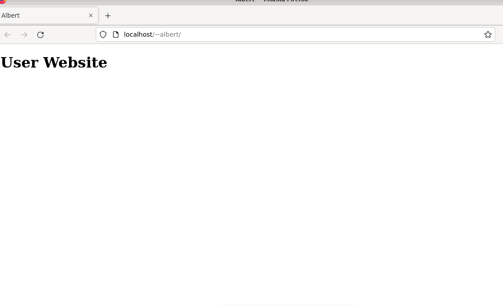
