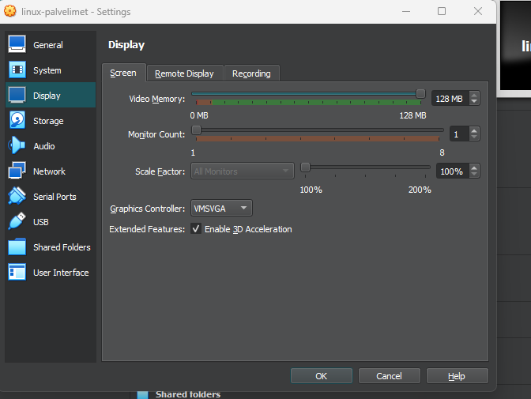

# linux-palvelimet
linux palvelimet kurssin palautukset

# h1 Oma Linux
Tässä kirjoitin tiivistelmän, missä kävin läpi teorian
## x) Raportin kirjoittaminen ja FSF:Free Software Definition muistiinpanot
- Täsmällinen teksti
- virheen uudelleen luominen
- Freedom to run(F0),Freedom to modify(F1), Freedom to copy(F2), Freedom to distribute(F3)

## a) Linuxin asentaminen
Koska minulla oli jo virtualbox ja Debian 12 live ISO valmiiksi ladattuna, tein uuden VM-koneen omalle raudalle.
Oman raudan specsit ovat CPU 6 ytimen-prosessori, 16GB ram, sekä tarpeeksi tallennustilaa.

### Ensin avasin virtualboxin seuraavasti

### VM-alkuasetukset
Tässä kohtaa valitsin new ja tein alkuasetukset VM-koneelle. Annoin nimeksi 'linux-palvelimet' VM-koneelle. Versioksi Valitsin Debian (64-bit). Varmistin myös, että "Skip unattended installation" on päällä. Disk Image:n jätin VDI:ksi.

### Vram-muistin alustava sijoitus
Laitoin että VM saa tarpeeksi näyttömuistia. Laitoin myös grafiikkakontrolleriksi VBoxSVGA.

### ISO-levystä asennus
Tässä sitten suoritin VM-koneen installerin, jotta sain Debian 12 live asennettua.

