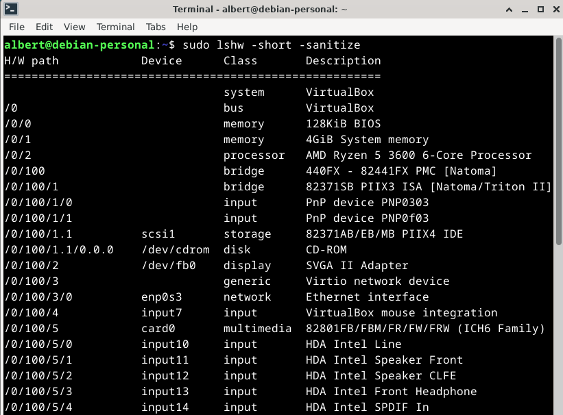
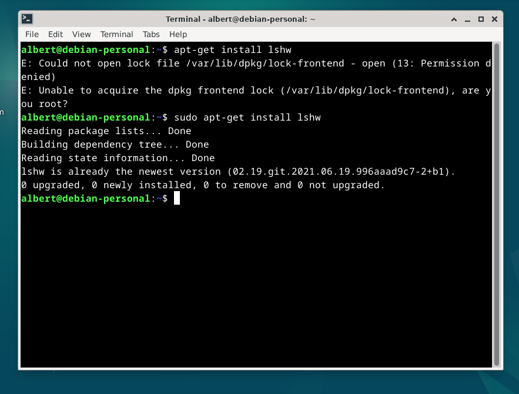
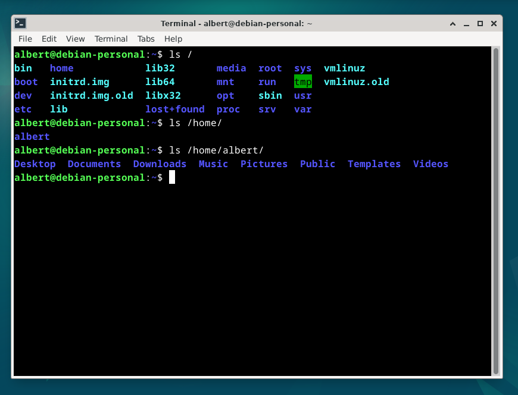
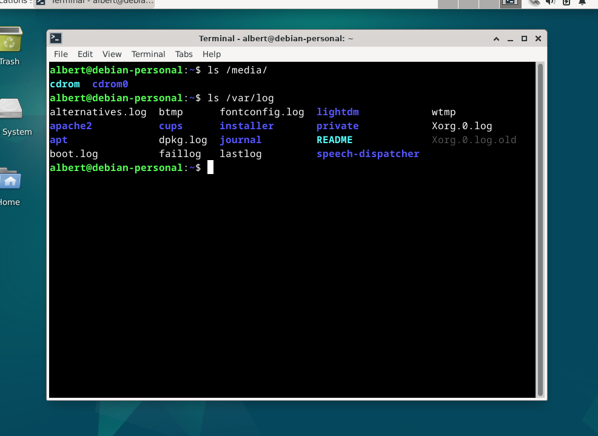
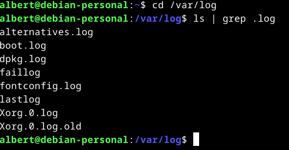
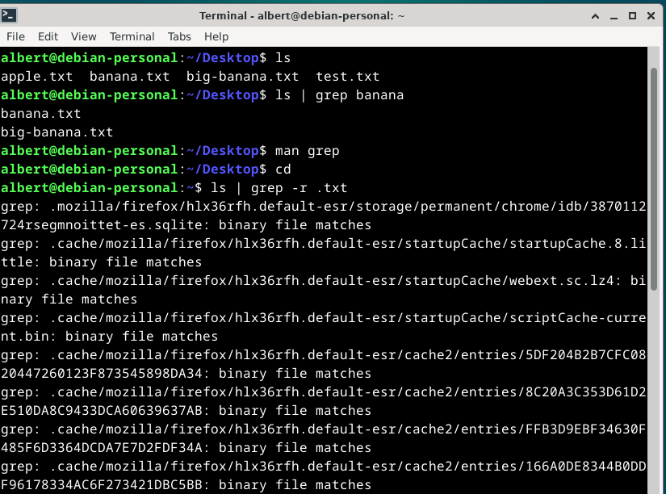
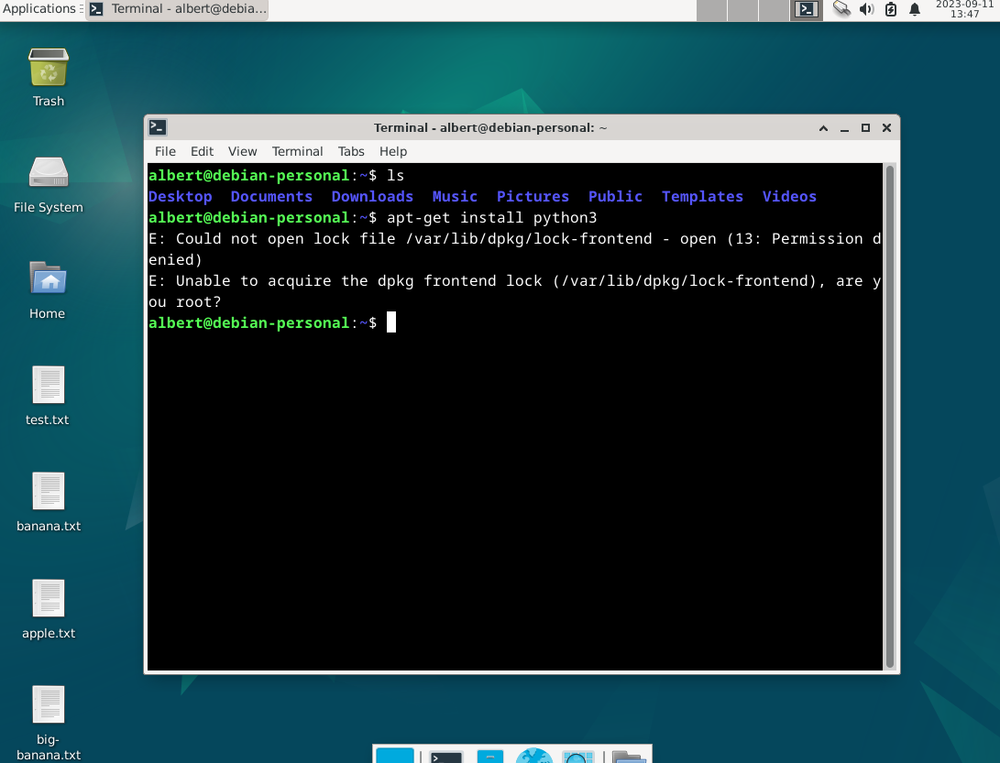

# h2 Komentaja pingviini
## x)Lue ja tiivistä muistiinpanot
 - "/etc/", järjestelmän asetukset ja yms.
 - "/var/log/", kaikki logit.
 - "sudo apt-get update", päivittää uusimmat mahdolliset asennettavat ohjelmat.
## a) Micron asennus
seuraavaksi asensin mikron.

## b) koneen rauta
on käytössä SSD, sekä tarpeeksi muistitilaa. Olen antanut virtuaaliselle koneelle käytöksi 4 ydintä(virtuaalista, joten säikeitä, koska löytyy prosessorilta säikeitä)
käytössä on nopea muisti, hyperX ram-muisti.
tarkistin koeeni raudan:
- Amd Ryzen 5 3600

## c) kolme ohjelmaa, micro(edellinen kuva), apache2, lshw

## d) FHS:Esittele kansiot

## e + f) GREP-komennot pipen kanssa

## g) Esimerkki onnistuneesta ja ei onnistuneesta komennosta

