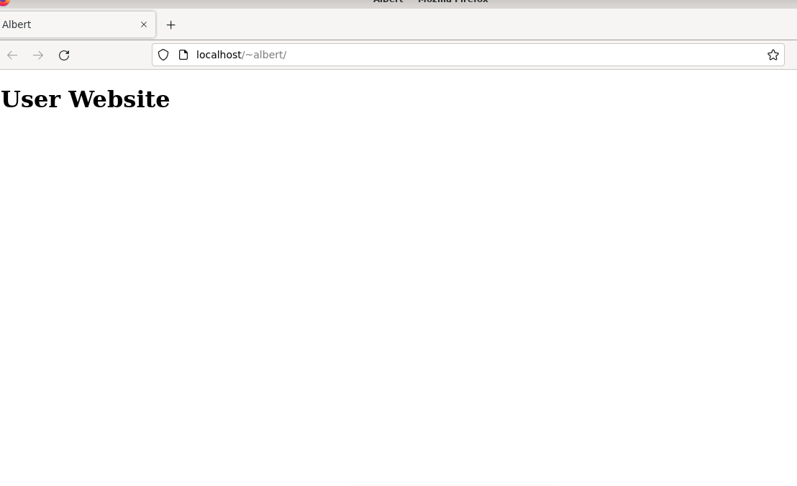

# h3 Web server
## x) Muistiinpanot
- "sudo a2enmod userdir", käyttäjille luvan antaminen
- "sudo systemctl restart apache2", jos on tehnyt muutoksia
## a) apache asennus
mulla oli jo valmiiksi asennettuna

## b) lokit
kukin rivi kertoo että on tehty GET-pyyntö. Ensin pyydetään hakukoneen tiedot, sitten iconi, joka on apachen oma ikoni. sitten pyydetään favicon.

## c) sivun vaihto uuteen

## d + e) Käyttäjän kotisivut
Ensin aktivoin käyttäjien sivut komennolla "sudo a2enmod userdir".
Sen jälkeen käynnistän apache2 uudelleen komennolla "sudo systemctl restart apache2".
Tämän jälkeen luon public_html kansion "/home/albert" kansion sisälle ja sen sisälle laitan muokatun index.html tiedoston.

Varmistin myös että oikeudet on oikein, että se avautuu ongelmitta.

Sivu on validi, koska ei ole mitään ylimääräistä roskaa.
## f)curl -l
Tässä käytän komentoa tekemään pyyntö sivustosta, jonka olen luonut ja näkyy sivuston koodi.

Tästä näkyy miten sivustoni muodostuu raakatiedostona. Kaikki GET-pyynnöt kuten faviconin etsiminen näkyy siinä.
